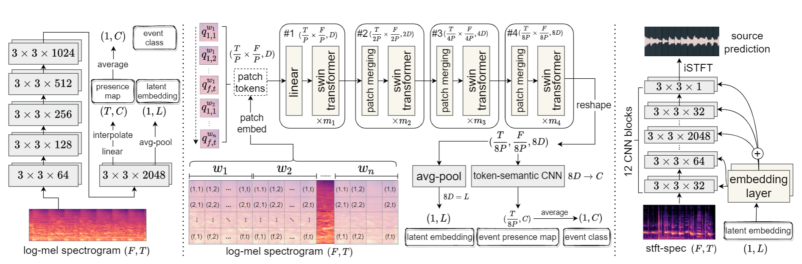
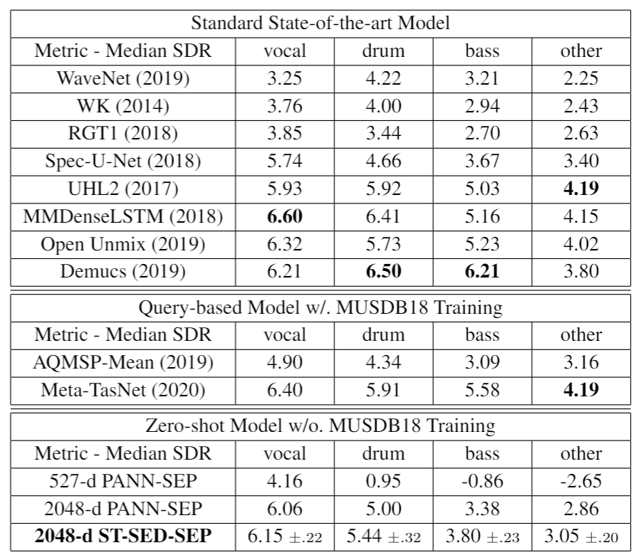

# Zero Shot Audio Source Separation

## Introduction

The Code Repository for "[Zero-shot Audio Source Separation through Query-based Learning from Weakly-labeled Data](https://arxiv.org/abs/2112.07891)", in AAAI 2022.

In this paper, we propose a three-component pipline that allows you to train a audio source separator to separate *any source* from the track. All you need is a mixture audio to separate, and a given source sample as a query. Then the model will separate your specified source from the track. Our model lies in a zero-shot setting because we never use the seapration dataset but a general audio dataset **AudioSet**. However, we achieve a very competible separation performance (SDR) in MUSDB18 Dataset compared with those supervised models. Our model has a generalization ability to unseen sources out of the training set. Indeed, we do not even require the separation dataset for training but solely **AudioSet**.

The demos and introduction are presented in our [short instroduction video](https://youtu.be/8XQ5ZyYRLQM) and [full presentation video](https://youtu.be/RgNwB_pJ7Cw). 

More demos will be presented in [my personal website](https://www.knutchen.com) (now under construction)




## Main Separation Performance on MUSDB18 Dataset
We achieve a very competible separation performance (SDR) in MUSDB18 Dataset **with neither seeing the MUSDB18 training data nor speficying source targets**, compared with those supervised models.

Additionally, our model can easily separate many other sources, such as violin, harmonica, guitar, etc. (demos shown in the above video link)

<p align="center">

</p>

## Getting Started

### Install Requirments
```
pip install -r requirements.txt
```

### Download and Processing Datasets

* config.py
```
change the varible "dataset_path" to your audioset address
change the classes_num to 527
```

* [AudioSet](https://research.google.com/audioset/download.html)
```
./create_index.sh # 
// remember to change the pathes in the script
// more information about this script is in https://github.com/qiuqiangkong/audioset_tagging_cnn

python main.py save_idc 
// count the number of samples in each class and save the npy files
```

* [MUSDB18](https://sigsep.github.io/datasets/musdb.html) - You can directly use [our processed musdb audio files](https://drive.google.com/drive/folders/1VwRnCxp3t2bXUS_MbXiFiggwkkJQEmha?usp=sharing) in 32000Hz sample rate. Or you set the "musdb_path" in the download path, and: 

```
python main.py musdb_process
// Notice that the training set is a highlight version, while the testing set is the full version
```


### Set the Configuration File: config.py

The script *config.py* contains all configurations you need to assign to run your code. 
Please read the introduction comments in the file and change your settings.
For the most important part:
If you want to train/test your model on AudioSet, you need to set:
```
dataset_path = "your processed audioset folder"
balanced_data = True
sample_rate = 32000
hop_size = 320 
classes_num = 527
```

### Train and Evaluation

## Train the sound event detection system ST-SED/HTS-AT
In thses monthes, we further integrated this system ST-SED into an independent repository, and evaluteed it on more datasets, improved it a lot and achieved better performance. 

You can follow [this repo](https://github.com/RetroCirce/HTS-Audio-Transformer) to train and evalute the sound event detection system ST-SED (or a more relevant name HTS-AT), the configuation file for training the model for this separation task should be [htsat_config.py](htsat_config.py).

For this separation task, if you want to save time, you can also download [the checkpoint](https://drive.google.com/drive/folders/1RouwHsGsMs8n3l_jF8XifWtbPzur_YQS?usp=sharing) directly.

## Train, Evaluate and Inference the Seapration Model

All scripts is run by main.py:
```
Train: CUDA_VISIBLE_DEVICES=1,2,3,4 python main.py train

Test: CUDA_VISIBLE_DEVICES=1,2,3,4 python main.py test

```
We recommend using at least 4 GPU cards with above 20GB memories per card. In our training phrase, we use 8 Nvidia V-100 (32GB) GPUs. 

We provide a quick **inference** interface by:
```
CUDA_VISIBLE_DEVICES=1,2,3,4 python main.py inference
```
Where you can separate any given source from the track. You need to set the value of "inference_file" and "inference_query" in *config.py*. Just check the comment and get it started. 


### Model Checkpoints:

We provide the model checkpoints in this [link](https://drive.google.com/drive/folders/1RouwHsGsMs8n3l_jF8XifWtbPzur_YQS?usp=sharing). Feel free to download and test it.

## Citing
```
@inproceedings{zsasp-ke2022,
  author = {Ke Chen* and Xingjian Du* and Bilei Zhu and Zejun Ma and Taylor Berg-Kirkpatrick and Shlomo Dubnov},
  title = {Zero-shot Audio Source Separation via Query-based Learning from Weakly-labeled Data},
  booktitle = {{AAAI} 2022}
}

@inproceedings{htsat-ke2022,
  author = {Ke Chen and Xingjian Du and Bilei Zhu and Zejun Ma and Taylor Berg-Kirkpatrick and Shlomo Dubnov},
  title = {HTS-AT: A Hierarchical Token-Semantic Audio Transformer for Sound Classification and Detection},
  booktitle = {{ICASSP} 2022}
}
```
